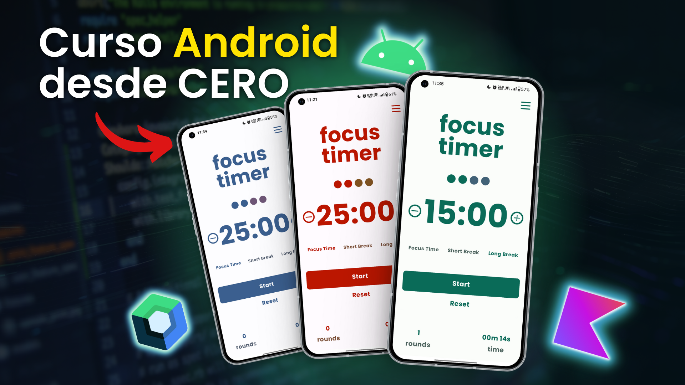
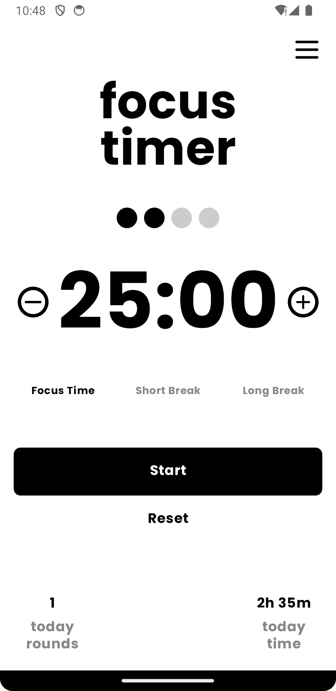
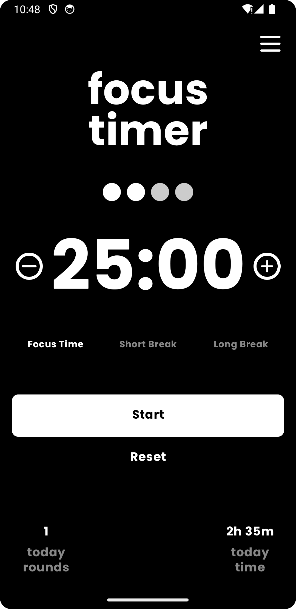
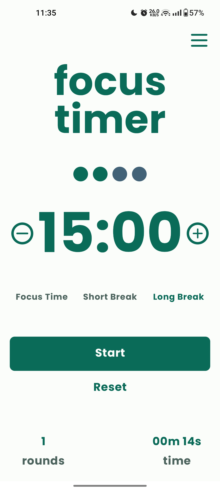
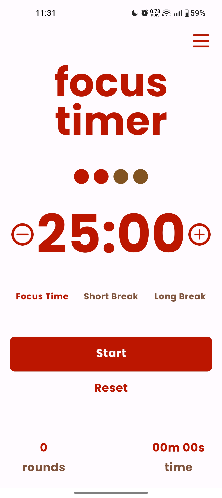
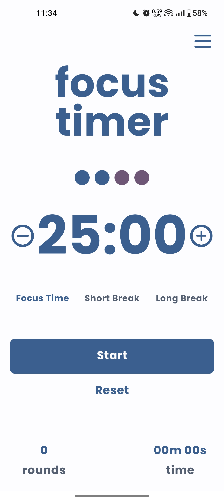
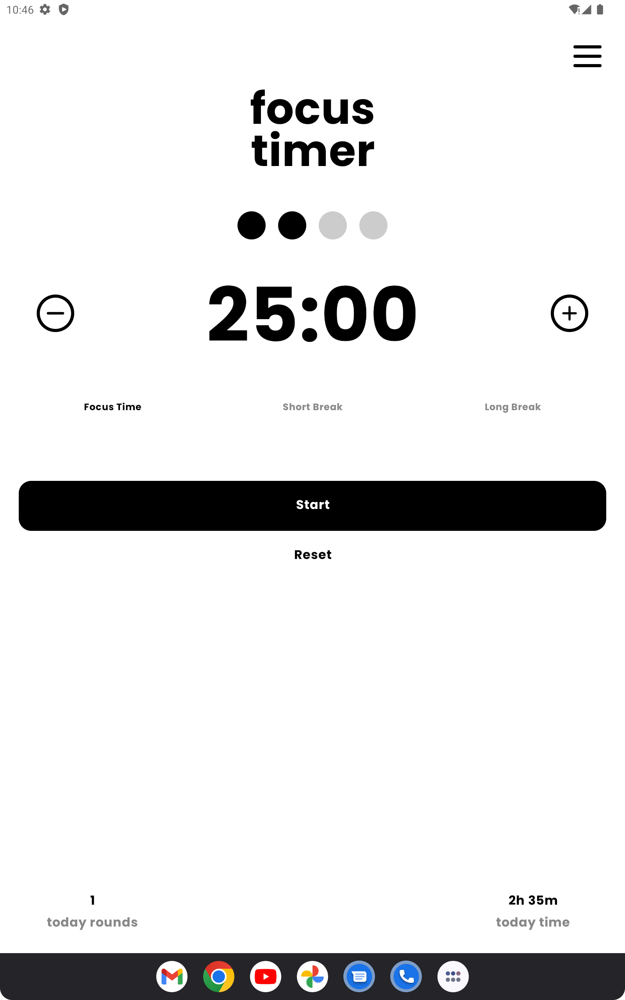
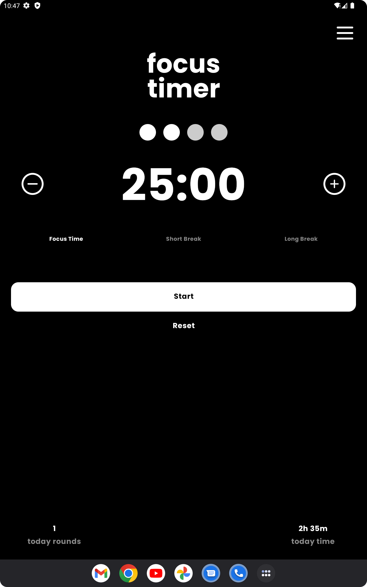

**Focus Timer** es una app Android creada para el [**Curso Android Desde Cero**](https://www.youtube.com/playlist?list=PLKzZ68VT1_2pH0O47HQsDmzLrIFh0YsF1).

> **Herramientas:** **Jetpack Compose,** **Android Native**, **Kotlin**, **Clean Code**, **MVVM**, **ROOM**, **TESTING**, **Clean Architecture**, **Theme**

> **Inspiración de Diseño:** **[Diseño](https://dribbble.com/shots/16055446-Focus-Timer)**

> **Recursos:** **[Recursos del Projecto, Fuentes e Iconos](https://drive.google.com/drive/folders/1yNw0V8__bb86FDv-Mq5mfEPQpgWBmFg4)**

### Preview
**Phone Portrait Preview:**

**Tablet Portrait Preview:**

### Cirilo Bido - Android Developer

